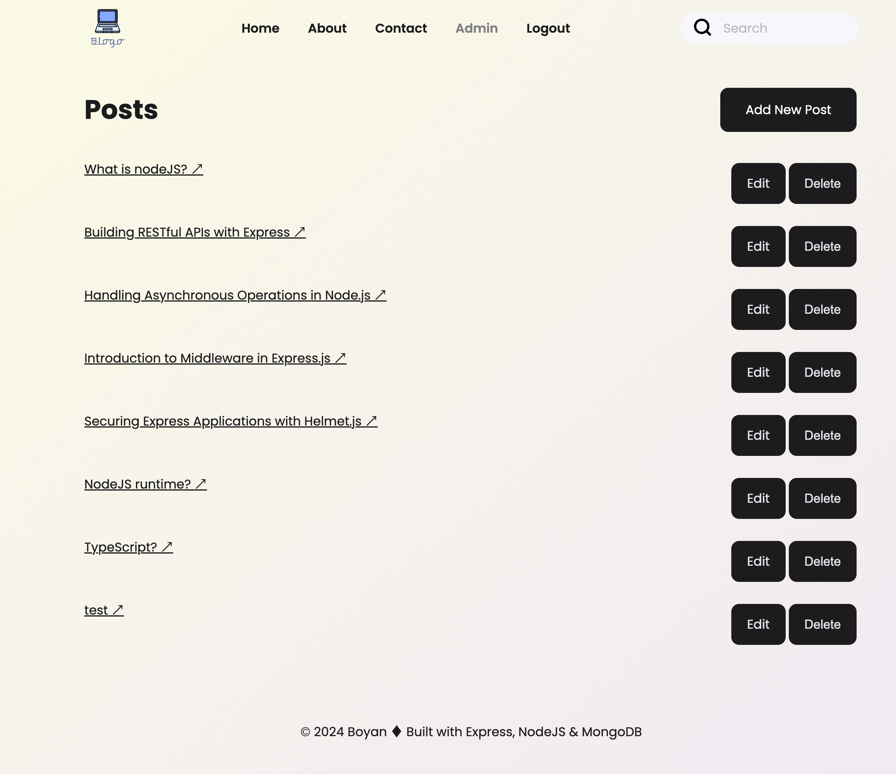
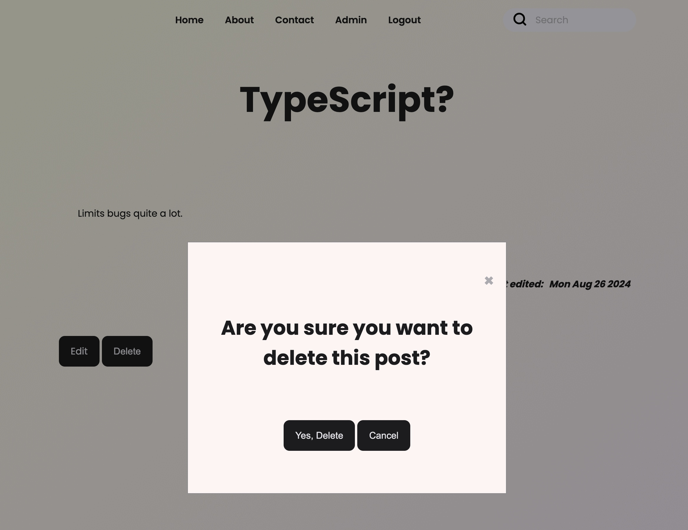
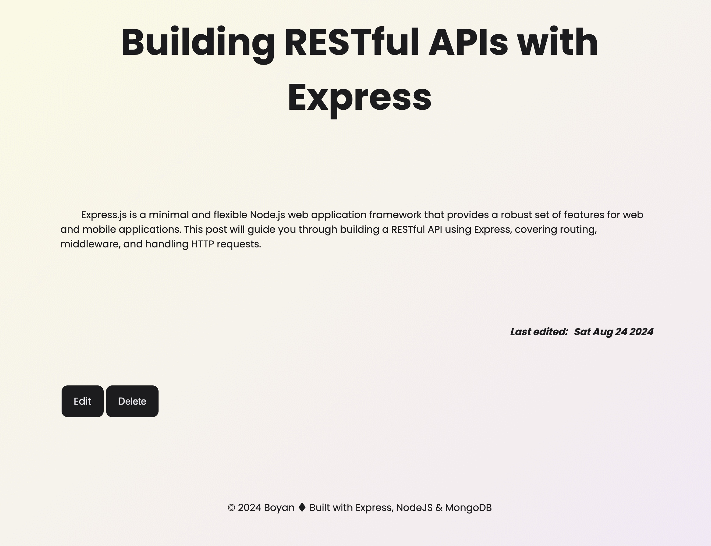
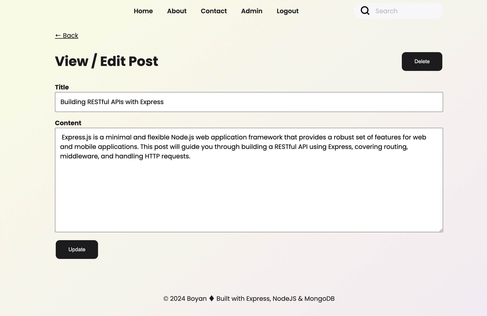

# Blogo - Boyan's personal Blog :writing_hand:	:man:	

### I've created this multi page app. (MPA) in order to showcase my skills with the use of the following technologies
-   NodeJS
-   Express
-   EJS
-   Mongoose
-   MongoDB

### Features
- :white_check_mark: Full CRUD support (for admin only), built-in admin credentials
  - :warning: For testing, please use:
    - username: admin
    - password: admin
- :newspaper_roll: Pagination functionality (latest 3 posts are rendered at home)
- :speech_balloon: Search functionality (search by matching characters in the title/body of all available posts)
- :closed_lock_with_key: Authorization (via JWT)

### Install
-   :warning: Note, the project requires .env variable for the DB & JWT secret key, please use the deployment link to look around instead. 
```bash
npm i
npm run dev

```

#### Deployment: https://www.blog.kachamachkov.com/

#### Images






